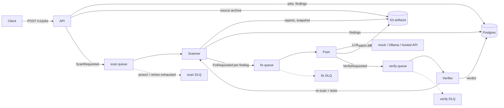

# patchloop

A find → fix → verify pipeline for security findings. You submit a repository or a source
archive; a scanner finds vulnerabilities; an LLM proposes a patch for each one; a verifier
applies the patch, re-scans and re-runs the tests.

This repository is the **plumbing**: containers, queues, Terraform, Kubernetes, CI, and the
Python contracts between services. The service logic itself is left as `TODO(simon)` with tests
that describe the finished behaviour. See [what to implement next](#what-šimon-implements-next).

## Architecture



Delivery is at-least-once. Every message carries a deterministic `idempotency_key`, consumers
record completed work before acknowledging, and each queue has a dead-letter queue: after
`maxReceiveCount` deliveries SQS moves the message there instead of retrying forever.

| Piece | Locally | On AWS (short demo) |
| --- | --- | --- |
| API + workers | Docker Compose, or kind | ECS Fargate (ARM64), workers scale to 0 |
| Postgres | `postgres:16` | RDS `db.t4g.micro` |
| SQS, S3, IAM | LocalStack 4.14 | real SQS + DLQ, S3, IAM |
| LLM | mock (default) or Ollama | mock or a hosted API. No GPU |

## Layout

```
packages/core/        settings, message schemas, queue/S3/LLM/scanner contracts, DB + worker loop
services/api/         FastAPI app (routes done, JobService is TODO)
services/scanner/     scan worker (handler, parsers, safe extract are TODO)
services/fixer/       fix worker (prompt, diff parsing, handler are TODO)
services/verifier/    verify worker (apply patch, verdict, handler are TODO)
demo-targets/         deliberately vulnerable sample app
infra/terraform/      modules + envs/localstack, envs/aws, envs/aws-account
deploy/k8s/           Kustomize base, kind overlay, kind + KEDA overlay
tests/                unit (default), integration (compose deps), e2e (full stack)
```

## Run it locally

Needs Docker, and `uv` (https://docs.astral.sh/uv/) for tests on the host.

```bash
make install          # uv sync + pre-commit hooks; copies .env.example to .env
make up               # build, terraform apply into LocalStack, migrate, start services
```

API docs: http://localhost:8420/docs. Readiness checks Postgres and the scan queue:

```bash
curl localhost:8420/readyz
curl -F file=@build/vulnerable-app.tar.gz\;type=application/gzip localhost:8420/v1/jobs/upload
```

`POST /v1/jobs` answers **501** until the job service is implemented. That is expected.
`make demo-tarball` builds the archive from `demo-targets/vulnerable-app`.

```bash
make logs             # api, scanner, fixer, verifier
make down             # stop and delete volumes
```

LocalStack is pinned to **4.14**, the last community image that starts without an auth token.
Newer tags (`2026.x`, `latest`) refuse to boot unless `LOCALSTACK_AUTH_TOKEN` is set.

Optional local model for the fixer (a few GB download):

```bash
docker compose --profile ollama up -d
# then set PATCHLOOP_LLM_PROVIDER=ollama and recreate the fixer
```

### Tests

```bash
make test                 # unit tests; TODO(simon) tests xfail until implemented
make todo                 # list the stubs and the tests waiting on them
make deps-up && make test-integration
make up && make test-e2e
```

`make ci` runs the same checks as GitHub Actions, including integration tests in a separate
compose project so it does not disturb a running `make up`.

### Terraform against LocalStack

`make up` already applies it (the `infra` container). To do it by hand:

```bash
make tf-plan
make tf-apply
make tf-destroy
```

The localstack env refuses any endpoint that is not a LocalStack host, so it cannot be pointed
at real AWS by accident. `make tf-check` runs `fmt`, `validate`, tflint and checkov for every
environment, including the AWS one, and needs no credentials.

### Kubernetes (kind)

```bash
make kind-up          # cluster, metrics-server, KEDA, Postgres, LocalStack, the app
kubectl -n patchloop port-forward svc/api 8421:80
make kind-down
```

`KEDA=0 make kind-up` skips KEDA; workers then stay at one replica. With KEDA they scale from
zero on SQS queue depth. The `patchloop` namespace enforces the restricted pod security
standard: non-root, read-only root filesystem, no capabilities.

## What to implement next

The build order, the exact tasks and the idea behind each layer are in
[docs/plan.md](docs/plan.md). In the repo, start here:

1. `packages/core/.../worker.py` — `Worker.process`, backoff, the Postgres idempotency store.
2. `packages/core/.../db/models.py` plus a migration (`make db-revision m="create core tables"`).
3. `services/api/.../services/jobs.py` — create a job and publish `ScanRequested`.
4. `services/scanner` — parse tool output, fingerprint findings, `handle_scan_requested`.
5. `services/fixer` — prompt, extract a diff, `handle_fix_requested`.
6. `services/verifier` — apply the patch, `decide_verdict`, `handle_verify_requested`.

A test marked `@pytest.mark.todo` xfails while the code raises `NotImplementedError`. When the
implementation is right the xfail becomes an unexpected pass and the suite goes red: delete the
marker. `make test-e2e` is the definition of the whole pipeline being done.

## Real AWS demo

`infra/terraform/envs/aws` reuses the same queue, bucket and IAM modules as LocalStack, and adds
the parts LocalStack does not stand in for:

- ECS Fargate on ARM64, in **public subnets with no NAT gateway**. Tasks get a public IP for
  egress; security groups allow port 8000 only from the CIDRs in `api_allowed_cidrs`, and
  workers have no ingress at all.
- RDS PostgreSQL `db.t4g.micro`, single-AZ, not publicly reachable, SSL required.
- ECR, CloudWatch Logs with one-day retention, SQS depth alarms that scale workers from zero.
- A separate `envs/aws-account` budget (alerts at $10, $25 and $50) that `make aws-down` does
  **not** delete, so a leftover resource still pages you.

Nothing here is applied by CI. CI only runs `terraform validate` and the linters.

**Expected cost while it is up:** about **$0.03–0.08 per hour** with the API running and the
workers scaled to zero (RDS `db.t4g.micro` ~$0.02/h, one Fargate task ~$0.01/h, one public IPv4
$0.005/h; SQS, S3 and logs are cents). Add roughly $0.02/h for each worker task that is actually
running. A one-hour demo is well under a dollar. RDS is free-tier eligible on a new account
(750 hours/month of `db.t4g.micro`), which drops the idle cost further. There is no NAT gateway
and no EKS control plane.

**Destroy it when the demo is over.** RDS and public IPv4 keep billing until destroy finishes.

```bash
cd infra/terraform/envs/aws-account && cp terraform.tfvars.example terraform.tfvars
# edit account id + email, then:
make aws-budget                              # once; alerts stay

cd infra/terraform/envs/aws && cp terraform.tfvars.example terraform.tfvars
# set aws_account_id, alert_email, api_allowed_cidrs (your IP /32)
make aws-up                                  # builds images, pushes to ECR, applies, migrates
make aws-down                                # terraform destroy + a leftover check
```

`make aws-up` refuses to run unless `aws sts` returns the account id in `terraform.tfvars`, and
the provider rejects any other account. For a hosted LLM set `llm_provider = "openai"` and put
the key in SSM (`/patchloop/openai_api_key`); it never goes in Terraform state or git. The fixer
never runs on a GPU instance.

`terraform.tfvars` is git-ignored. State for these envs is local on purpose: the demo env is
created and destroyed, not shared. Move it to an S3 backend with locking if it ever lives longer
than a demo.

## CI

`.github/workflows/ci.yml` runs lint, mypy, unit tests, integration tests (compose), Terraform
checks with no credentials, Kustomize render, image builds, and Bandit, Semgrep, pip-audit and
Trivy. Cursor Origin does not run GitHub Actions; `make ci` is the same pipeline locally. Mirror
the repo to GitHub (`cicmen35`) when you want the workflow itself.

Accepted scan exceptions are listed, with reasons, in `.trivyignore` and
`infra/terraform/.checkov.yaml`.
